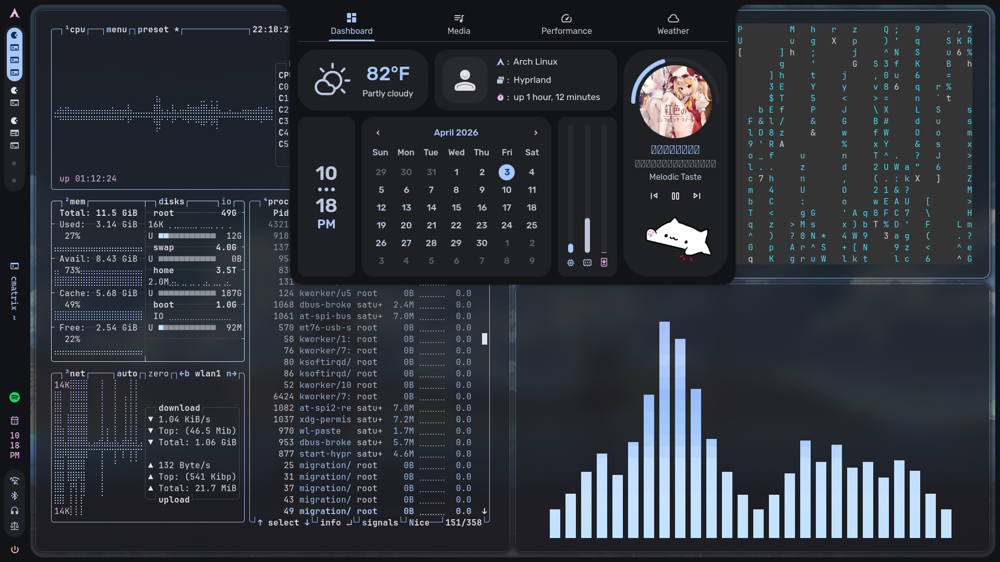

# 💫 About Me:
A J1 student studying in Singapore, passionate in Platform Engineering & Cybersecurity :D! I enjoy ricing & experimenting with my arch server as a hobbyist~

Learning:
- Advanced Kubernetes -- Helm, Ingress, scaling, persistence
- Service Meshing with Istio & Admiral (Multi-cluster Ops)
- Provisioning with Terraform

Currently Exploring:
- GitOps with ArgoCD
- Cloud platforms (Azure, AWS)
- Configuration Management with Ansible
- Internal Developer Portals (Backstage)
- Secrets Management with HashiCorp Vault
- Artifact Management with Artifactory (JFrog)

repos are private for security & privacy~

discord @saturdaysev

SST Grad'25

# 💻 Skills:

### Languages

### Infrastructure

#### Container & Orchestration

#### Observability

#### Networking & Deployment

#### Backend / Frontend

### Others

# GitHub Stats:
 
 

# My Rice~

